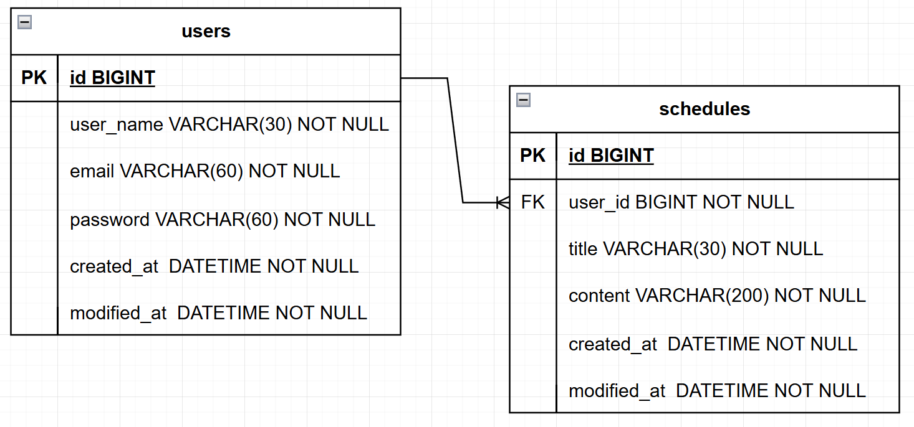

# Scheduler API

Spring Boot와 JPA를 사용해 구현한 일정 관리 API 프로젝트입니다.

## 프로젝트 개요

유저를 생성하고 로그인한 뒤, 일정과 댓글을 생성, 조회, 수정, 삭제할 수 있는 REST API 서버입니다.

세션 기반 인증을 사용하며, 일정 목록 조회 시 댓글 수와 작성자 이름을 함께 제공합니다.

## 기술 스택


## 주요 기능

- 유저 생성, 전체 조회, 단건 조회, 수정, 삭제
- 로그인 및 세션 기반 인증
- 일정 생성, 전체 조회, 단건 조회, 수정, 삭제
- 댓글 생성, 목록 조회, 수정, 삭제
- 일정 목록 페이징 조회
- 일정 목록 조회 시 댓글 수와 작성자 이름 포함
- 유효성 검증 및 공통 예외 응답 처리

## API 요약

| Method   | URL                               | 설명       |
|----------|-----------------------------------|----------|
| `POST`   | `/users`                          | 유저 생성    |
| `GET`    | `/users`                          | 전체 유저 조회 |
| `GET`    | `/users/{userId}`                 | 선택 유저 조회 |
| `PATCH`  | `/users/{userId}`                 | 유저 수정    |
| `DELETE` | `/users/{userId}`                 | 유저 삭제    |
| `POST`   | `/users/login`                    | 로그인      |
| `POST`   | `/schedules`                      | 일정 생성    |
| `GET`    | `/schedules`                      | 전체 일정 조회 |
| `GET`    | `/schedules/{scheduleId}`         | 선택 일정 조회 |
| `PATCH`  | `/schedules/{scheduleId}`         | 일정 수정    |
| `DELETE` | `/schedules/{scheduleId}`         | 일정 삭제    |
| `POST`   | `/schedules/{scheduleId}/comment` | 댓글 생성    |
| `GET`    | `/schedules/{scheduleId}/comment` | 댓글 목록 조회 |
| `PATCH`  | `/comment/{commentId}`            | 댓글 수정    |
| `DELETE` | `/comment/{commentId}`            | 댓글 삭제    |

상세 요청/응답 예시는 [API 명세서](./docs/api-spec.md)에서 확인할 수 있습니다.

## ERD



## 프로젝트 구조

```text
src/main/java/com/vanilalatte/scheduler
├─ comment
│  ├─ controller
│  ├─ dto
│  ├─ entity
│  ├─ repository
│  └─ service
├─ global
│  ├─ config
│  ├─ entity
│  ├─ exception
│  └─ util
├─ schedule
│  ├─ controller
│  ├─ dto
│  ├─ entity
│  ├─ repository
│  └─ service
├─ user
│  ├─ controller
│  ├─ dto
│  ├─ entity
│  ├─ repository
│  └─ service
└─ SchedulerApplication.java
```

각 계층의 역할은 다음과 같습니다.

- `controller` : HTTP 요청/응답 처리
- `dto` : 요청 및 응답 데이터 전달
- `entity` : 유저, 일정, 댓글 및 공통 시간 필드 정의
- `repository` : 데이터 접근
- `service` : 비즈니스 로직 처리
- `global` : 공통 설정, 예외 처리, 공통 유틸 관리

## 실행 방법

### 1. MySQL 준비

```sql
CREATE DATABASE scheduler_db;
```

### 2. 환경 설정

`src/main/resources/application.properties`는 환경 변수를 사용하도록 설정되어 있습니다.

아래 값을 환경 변수로 등록합니다.

```properties
URL=jdbc:mysql://localhost:3306/scheduler_db
USERNAME=your_username
PASSWORD=your_password
```

### 3. 애플리케이션 실행

```bash
./gradlew bootRun
```

> Windows 환경에서는 `gradlew.bat bootRun`을 사용합니다.

기본 실행 주소: `http://localhost:8080`

## 구현 포인트

- `BaseEntity`에서 `createdAt`, `modifiedAt`을 공통으로 관리합니다.
- 로그인 성공 시 세션에 `userId`를 저장하고, 인증이 필요한 API에서 세션 값을 사용합니다.
- 비밀번호는 `BCrypt`로 암호화해서 저장합니다.
- 유저 수정/삭제는 본인만 수행할 수 있습니다.
- 일정 생성/수정/삭제는 로그인한 사용자만 수행할 수 있으며, 수정/삭제는 작성자 본인만 가능합니다.
- 댓글 생성/수정/삭제는 로그인한 사용자만 수행할 수 있으며, 수정/삭제는 작성자 본인만 가능합니다.
- 일정 전체 조회는 `page`, `size` 파라미터를 받는 페이지 조회 방식입니다.
- 일정 전체 조회 응답에는 `commentCount`, `userName`이 포함됩니다.
- `@Valid`와 예외 핸들러를 사용해 입력값 검증 실패를 `400 Bad Request`로 처리합니다.

## 트러블슈팅

### 1. 페이징 조회 구현 방식 변경

초기에는 `findAll()` 기반 전체 조회를 사용하고 있어, 페이징 요구사항을 반영하면서 댓글 수와 작성자명까지 함께 조회하기가 비효율적이었습니다.  
목록 조회 구조를 `Pageable`, `Page` 기반으로 변경하고, 리포지토리에서는 JPQL DTO 프로젝션으로 필요한 필드만 조회하도록 개선했습니다.  
이후 수정일 기준 내림차순 정렬, 기본 페이지 크기 적용, 댓글 수와 작성자명을 포함한 응답까지 한 번에 처리할 수 있게 되었습니다.

### 2. 전역 예외 처리 구조 개선

예외 응답이 서비스 곳곳에서 개별적으로 처리되다 보니, 에러 형식과 상태 코드 기준이 일관되지 않는 문제가 있었습니다.  
이를 정리하기 위해 `ServiceException`을 공통 부모 예외로 두고, 도메인별 커스텀 예외와 `@RestControllerAdvice` 기반 `GlobalExceptionHandler`를 적용했습니다.  
그 결과 Validation 예외와 비즈니스 예외를 같은 형식으로 응답할 수 있게 되었고, 예외 처리 흐름도 더 명확해졌습니다.
